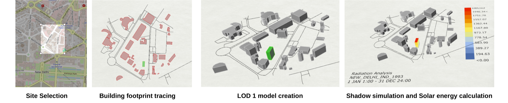
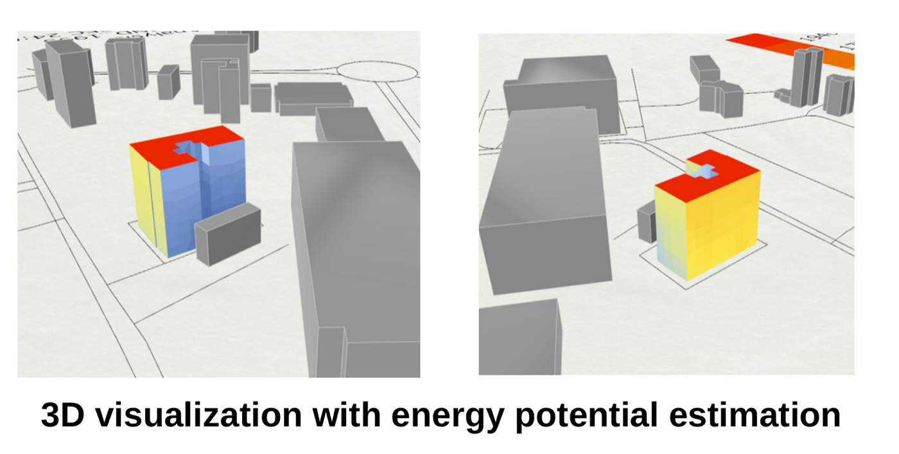
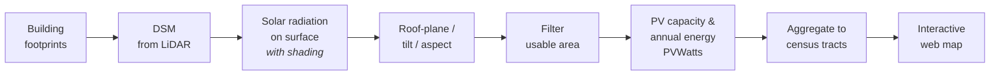
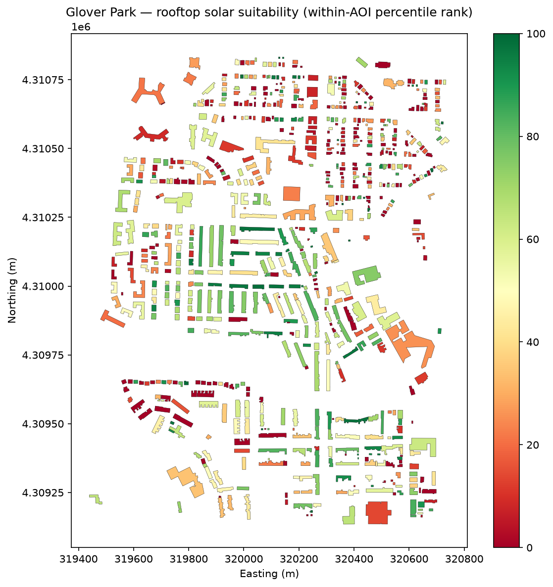

<h1 align="center">Rooftop Solar Potential</h1>

  <em>A city-scale pipeline that scores <strong>every rooftop</strong> for solar suitability — 
  the engineering evolution of a Grasshopper + Ladybug prototype into a reproducible pipeline over an entire city.</em>

  
  
  
  
  

---

Per-roof geometry, orientation, tilt, shading, and irradiance → estimated **PV capacity, annual
energy, and CO₂ offset** — then aggregated to neighbourhood choropleths with an equity lens. Built
from **public data and APIs**, modelled in **open-source Python**, and delivered as an **interactive
web map**. The Esri stack is *one supported deployment target, not a dependency*.

> **Status: Phase 1 MVP complete.** The full pipeline — footprints → DSM → shaded radiation → roof
> planes → usable area → PV yield — now runs end-to-end in [`src/rooftop_solar/`](src/rooftop_solar/)
> for Glover Park and passes the Esri benchmark ([see the result below](#stage-1-result--glover-park-benchmarked-against-esri)).
> The [walkthrough notebooks](notebooks/) remain the plain-language tour of how each stage works.
> Next: Phase 2 — city scale, ML roof segmentation, census-tract aggregation, and the deployed web
> map (see the [roadmap](docs/roadmap.md)).

## Lineage — from a hackathon prototype to a city pipeline

This is **not** a from-scratch portfolio piece. In 2024 I built a working **Grasshopper / Rhino +
Ladybug** prototype (Smart India Hackathon, PS SIH1739 — Team Operation_VIJAY) that pulled
OpenStreetMap footprints, extruded them into a **LOD-1 city model** of central New Delhi, and ran
**full-year solar-radiation and inter-building shadow simulation** to compute BIPV potential on
rooftops *and* facades.

  
   
  <em>The 2024 SIH prototype pipeline (New Delhi): site selection → building-footprint tracing → LOD-1 city model → full-year shadow simulation &amp; solar-radiation analysis (kWh/m²).</em>

The prototype already proved the hard part — **mutual shading between neighbouring buildings**, and
solar potential on *vertical facades*, not just roofs:

  
   
  <em>Per-building solar energy potential on the LOD-1 model — hot roofs/facades in red, shaded surfaces in blue.</em>

**This project scales that instinct** — from one neighbourhood in a design tool to an *entire city in
a reproducible pipeline*, trading hand-built LOD-1 blocks for LiDAR-derived per-roof geometry and
deep-learning roof segmentation. This version earns the resolution and the scale.

Prototype deck: [`docs/reference/SIH2024_BIPV_Solar_Prototype_Deck.pdf`](docs/reference/SIH2024_BIPV_Solar_Prototype_Deck.pdf).

## The pipeline

**Two modelling modes behind one interface:**

| Mode | Geometry front-end | When |
|---|---|---|
| **LiDAR per-roof** *(v1 default)* | Clip LiDAR per footprint, fit individual roof planes | Dense-data cities (Washington DC) |
| **Block-model / LOD-1** *(heritage + fallback)* | Extrude footprints to one height per building | Sparse-data cities (India) — the mode the SIH prototype ran on |

The geometry front-end is swappable; radiation → yield → aggregation is identical downstream.

## Stage 1 result — Glover Park, benchmarked against Esri

Phase 1 runs the whole spine in [`src/rooftop_solar/`](src/rooftop_solar/) and scores every roof in
Washington DC's Glover Park — one command: `python scripts/run_stage1.py`.

  
   
  <em>Per-roof suitability — the within-AOI percentile rank of each roof's annual energy density — exported alongside a GeoPackage of the full per-roof estimates (capacity, energy, CO₂, tilt/aspect, fit uncertainty).</em>

It **passes** the sanity-check against Esri's "Estimate solar power potential" tutorial on the
size-independent metric — specific yield 1162 vs Esri's 1150 (<1%) — and the OSM run reproduces the
notebook-05 anchor (14.35 MWh/building) exactly. The full comparison, and the finding that Microsoft's
footprints *merge* Glover Park's rowhouses (which is why per-building energy needs a footprint-aware
reading), are written up in
[`docs/benchmarks/stage-1-glover-park-esri.md`](docs/benchmarks/stage-1-glover-park-esri.md).

## Walkthrough notebooks

The [`notebooks/`](notebooks/) directory is the **visual, plain-language way in** — the whole
Phase 1 pipeline explored end-to-end on a small scale (real data, real maps, worked maths)
before it's formalised into `src/rooftop_solar/`. Rendered outputs are committed, so they read
on GitHub without running anything:

- [`00_pipeline_overview`](notebooks/00_pipeline_overview.ipynb) — the end-to-end map, and the whole chain worked by hand on one toy roof
- [`01_footprints_and_dsm`](notebooks/01_footprints_and_dsm.ipynb) — footprints + DSM, and the **DSM-vs-DTM shading trap** proved by subtracting one surface from the other
- [`02_radiation_rsun`](notebooks/02_radiation_rsun.ipynb) — solar radiation with GRASS `r.sun`, **inter-building shading** shown shaded-vs-unshaded
- [`03_roof_planes`](notebooks/03_roof_planes.ipynb) — per-roof tilt/aspect via RANSAC, with fit-quality **uncertainty** reported honestly
- [`04_usable_area_and_yield`](notebooks/04_usable_area_and_yield.ipynb) — usable area → PV capacity/energy/CO₂ → a per-roof **suitability score**
- [`05_benchmark_esri`](notebooks/05_benchmark_esri.ipynb) — the full run at neighbourhood scale, **benchmarked against Esri's** Glover Park tutorial

See [`notebooks/README.md`](notebooks/README.md) for the full index.

## Roadmap at a glance

| Phase | Scope |
|---|---|
| **0 · Scoping & de-risking** | Pick study area (Washington, DC), confirm LiDAR coverage, get the NLR API key, decide the radiation engine |
| **1 · MVP** | One DC neighbourhood, end-to-end → per-building suitability score + static map |
| **2 · Full** | City-scale + ML segmentation + census-tract aggregation + deployed web app |
| **3 · India** | Re-version via modular adapters + the block-model fallback path |

Full detail in [`docs/roadmap.md`](docs/roadmap.md).

## Docs

| File | What |
|---|---|
| [`docs/reference/Rooftop_Solar_Project_Plan.pdf`](docs/reference/Rooftop_Solar_Project_Plan.pdf) | **The full engineering plan** — source of truth |
| [`docs/architecture.md`](docs/architecture.md) | Two modelling modes, provider interface, Esri deployment track |
| [`docs/data-sources.md`](docs/data-sources.md) | Every data layer, source, and access notes (US v1) |
| [`docs/risks.md`](docs/risks.md) | Honest risks, the inter-building shading traps, reference benchmarks |
| [`docs/roadmap.md`](docs/roadmap.md) | Phased roadmap |
| [`docs/reference/SIH2024_BIPV_Solar_Prototype_Deck.pdf`](docs/reference/SIH2024_BIPV_Solar_Prototype_Deck.pdf) | The 2024 prototype this project grows from |
| [`docs/reference/Foundations_Geospatial_ML.pdf`](docs/reference/Foundations_Geospatial_ML.pdf) | Reading list — geospatial data science & ML foundations (background) |
| [`docs/reference/Resources_GeoAI_Solar.pdf`](docs/reference/Resources_GeoAI_Solar.pdf) | Reading list — curated GeoAI-for-solar resources (background) |

## License & credits

Released under the [MIT License](LICENSE) — free to use, modify, and build on for **personal,
community, academic, and commercial** purposes. The one condition: **keep the copyright and license
notice**, i.e. give credit.

If this work helps yours, a citation or link back is appreciated:

> Dhruv Kapri, *Rooftop Solar Potential* (2026). https://github.com/Dhruv-Kapri/Rooftop-Solar-Potential

**Credits:** builds on the 2024 Smart India Hackathon BIPV prototype (PS SIH1739) by
**Team Operation_VIJAY**. Prototype figures in this README are from that team's project deck.
