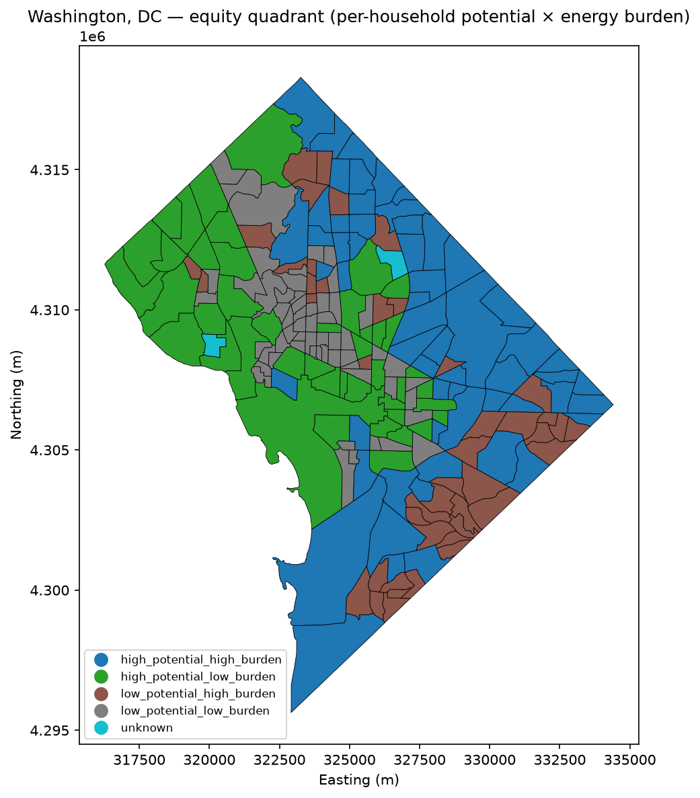

# Stage 2 · Part 2-2 — city-scale results (whole District of Columbia)

- **Date:** 2026-09-08 · **Phase:** 2 (Part 2-2) · **Plan:** [`stage-2-part2-plan.md`](../plans/stage-2-part2-plan.md) · **ADR:** [0009](../adr/0009-city-scale-tiling-and-idempotency.md)
- **Reproduced by:** `python scripts/run_city.py` → `outputs/12day/` (calibrated 12-day) · `--day-range 172` → `outputs/1day/` (fast preview)
- **Acceptance:** no external city-wide benchmark exists — accepted on **invariants + sanity + the payoff** (plan §6), like Part 2-1.

> **STATUS: COMPLETE — the calibrated 12-day full-DC run landed 2026-09-08** (66 tiles, 100,064 roofs,
> ~4.85 h wall-clock; deliverables in `outputs/12day/`). Both columns below are real full-DC data:
> **1-day** is an uncalibrated single-day preview (geometry/counts exact, absolute energy not usable),
> **12-day** is the ADR-0001 calibrated run. This doc is the §8 deliverable.

## Verdict

**Accepted.** **Seam conservation** holds (Σ per-tile roof counts = 100,064 merged — every DC building
scored once) and **idempotency** holds — both verified by the `integration` smoke
(`tests/test_pipeline_city_integration.py`). The tract **equity map is populated** (206 tracts, 58
priority, 2 data-missing — Part 2-1's partial-coverage artifact resolved). City totals sit **above**
NREL's DC technical potential (see Sanity) — a documented over-estimate from the usable-area/footprint
model, **not** a radiation error; the **specific yield recovers to ~1,124 kWh/kWp** (near Stage-1's
Esri-validated ~1,162), which is the calibration signal that matters.

  
   
  <em>The Phase-2 payoff (calibrated 12-day): each DC tract placed in a 2×2 equity quadrant
  (per-household solar potential × energy burden); the <strong>58 priority</strong> tracts — high
  potential <em>and</em> high burden — are where rooftop solar does the most equity good.</em>

## The dataset (day-count-independent — holds for both runs)

| Property | Value |
|---|---|
| Roofs scored, whole DC | **100,064** (usable **57,648**) |
| City per-roof file | **18.1 MB** GeoParquet (`dc_roofs.parquet`) |
| Geometry weight | ~676k vertices (mean **6.9/roof** — simple MS footprints) |
| Grid | **66 tiles** @ 2 km (fixed origin `(315000, 4295000)`, EPSG:6347); **0 empty** (dense urban) |
| Census tracts covered | **206** (priority **57**, data-missing **2**) |

## Compute-cost run-log (§8)

| | 1-day (preview) | 12-day (calibrated) |
|---|---|---|
| Tiles | 66 (65 + 1 retried after a transient auth failure) | 66 (all with roofs, 0 empty) |
| Failed tiles | 0 (after one resume pass) | 0 |
| Wall-clock (cold) | not captured¹ | 17,454 s (~4.85 h) |
| Per-tile mean | — | 264.5 s |

¹ The original 1-day run's timing was lost to a since-fixed CLI crash; the resume was cache-warm
(2.9 s), so it is **not** a real cold-run figure. The **12-day cold run above is the authoritative
timing** — the figure Parts 2-4/2-5 budget their re-runs against.

## 1-day vs 12-day — what fidelity changes (and what it doesn't)

The comparison is the point: single-day vs 12-day calibrated is a **radiation-fidelity** difference.
Absolute magnitudes scale; the **equity ranking is expected to be robust** (single-day inflates every
roof ~proportionally, so relative per-household potential — and the quadrant classification — barely
moves). **Confirm once the 12-day run lands.**

| Quantity | 1-day (uncalibrated) | 12-day (calibrated) | Note |
|---|---|---|---|
| Installed capacity | 3,619 MW (~3.6 GW) | **3,619 MW** | day-independent (usable area) — confirms capacity doesn't scale with fidelity |
| Annual energy | 5,998 GWh/yr (~6.0 TWh) | **4,067 GWh/yr (~4.1 TWh)** | calibration cuts it ~32% |
| Annual CO₂ offset | ~2,099 kt/yr (~2.1 Mt) | **~1,424 kt/yr (~1.4 Mt)** | scales with energy |
| **Specific yield** (kWh/kWp/yr) | **~1,657** | **~1,124** | **prediction held:** within ~3% of Stage-1's Esri-validated ~**1,162** ✓ |
| Priority tracts (high × high) | 57 / 206 | **58 / 206** | **~unchanged** as predicted (ranking robust) |

## Sanity vs NREL (a smell test, not a gate — risks §15)

NREL's DC rooftop-PV **technical potential** is order **~1.3 GW / ~1.6 TWh/yr** (confirm exact figure
vs risks §15). The **1-day** totals (~3.6 GW / ~6.0 TWh) were inflated by the single-day extrapolation.
The **12-day calibrated** totals (**~3.6 GW / ~4.1 TWh**) fix the *energy* — specific yield recovers to
~1,124 kWh/kWp, near the Esri ~1,162 — but still sit **~2.8× / ~2.5× above NREL**, because **capacity**
is day-independent and our **usable-area estimate overstates** it (the flat ×0.70 utilization + MS
footprint rowhouse merging, ADR-0003/0005). This is a *geometry / usable-area* over-estimate, not a
radiation one — and it is exactly the lever **Part 2-4** attacks (obstruction-aware usable area,
ADR-0013). Reported honestly, not smoothed over.

## Caveats

- **1-day absolute numbers are not real** — single-day extrapolation. Use them only for scale/ranking.
- **MS footprint rowhouse merging** (ADR-0005) persists at scale: per-*building* metrics are unstable,
  but aggregates, specific yield, and the **per-household** equity metric are robust to it.
- **DSM vintage seam** across the District (2018 vs 2014/15 3DEP mosaics; roadmap Phase-1 finding) grows
  city-wide — a data-quality note, not silently averaged over.
- **Transient Planetary Computer auth/SAS failures** on a long run cost ~1 tile; **skip-and-continue**
  records it and a **resume** pass retries it (verified: tile `11_3` failed then succeeded on resume).
- **Radiation fidelity is the 12-day sample** (ADR-0001); the DSM is 2 m PC (ADR-0009). Finer DSM /
  365-day sum / explicit `r.horizon` are Part 2-5, and would re-run this whole city pass.
